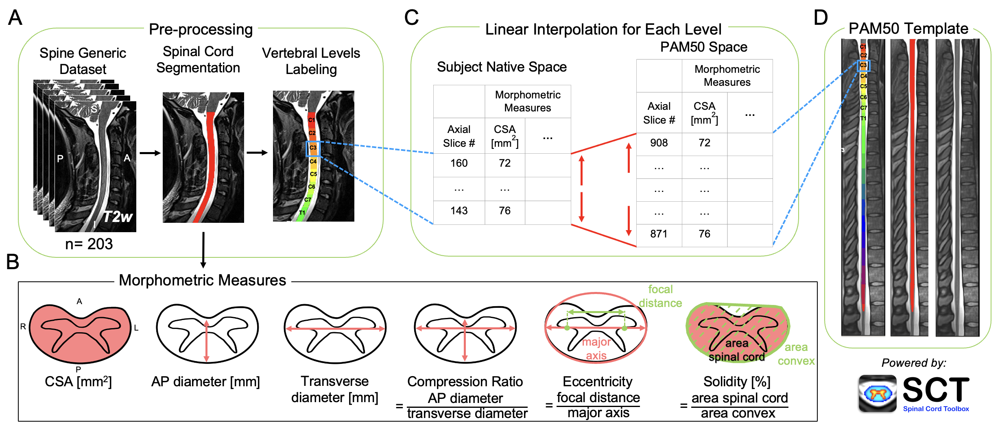

# A database of the healthy human spinal cord morphometry in the PAM50 template space

[Link to interactive preprint](https://preprint.neurolibre.org/10.55458/neurolibre.00016)

Spinal cord morphometry measures derived from magnetic resonance imaging (MRI) scans serve as valuable prognostic biomarkers 
for various spinal cord pathologies. Despite their significance, interpreting these biomarkers is challenging due to substantial 
variability between subjects. The lack of a standardized normalization method to mitigate this variability and the need for a 
better understanding of morphometric distribution contribute to the current knowledge gap.

In this work, we present a database of healthy normative values for six commonly used measures of spinal cord morphometry built 
using a new fully-automatic normalization approach. Morphometric measures were computed from a large open-access dataset of 
healthy adult volunteers (N = 203) and brought to the common space of the PAM50 spinal cord template using a newly proposed 
normalization method based on linear interpolation (Figure 1).

The database is interactive, available online ([https://preprint.neurolibre.org/10.55458/neurolibre.00016](https://preprint.neurolibre.org/10.55458/neurolibre.00016)) and allows filtering for sex, age, 
and MRI vendors. The proposed method is open-source and easily accessible through the Spinal Cord Toolbox (SCT) v6.0 and higher. 

This new morphometric database allows researchers to normalize morphometrics based on sex and age, thereby minimizing inter-subject 
variability associated with demographic and biological factors.

<b>FIGURE 1</b>  Schematic representation of the normalization approach. <b>(A)</b> T2-weighted images of 203 participants 
from the <i>spine-generic</i> dataset (multi-subject) were used. The spinal cord was segmented, and vertebral levels were 
identified automatically using the Spinal Cord Toolbox (SCT). <b>(B)</b> Six morphometric measures were computed for each 
axial slice from the single-subject segmentation masks. <b>(C)</b> For each level, the number of slices in the subject native 
space and the corresponding level in the PAM50 template <b>(D)</b> were identified. Then, the morphometric measures were 
linearly interpolated to the PAM50 space using the number of slices in the PAM50 template and the subject native space for 
each vertebral level.

